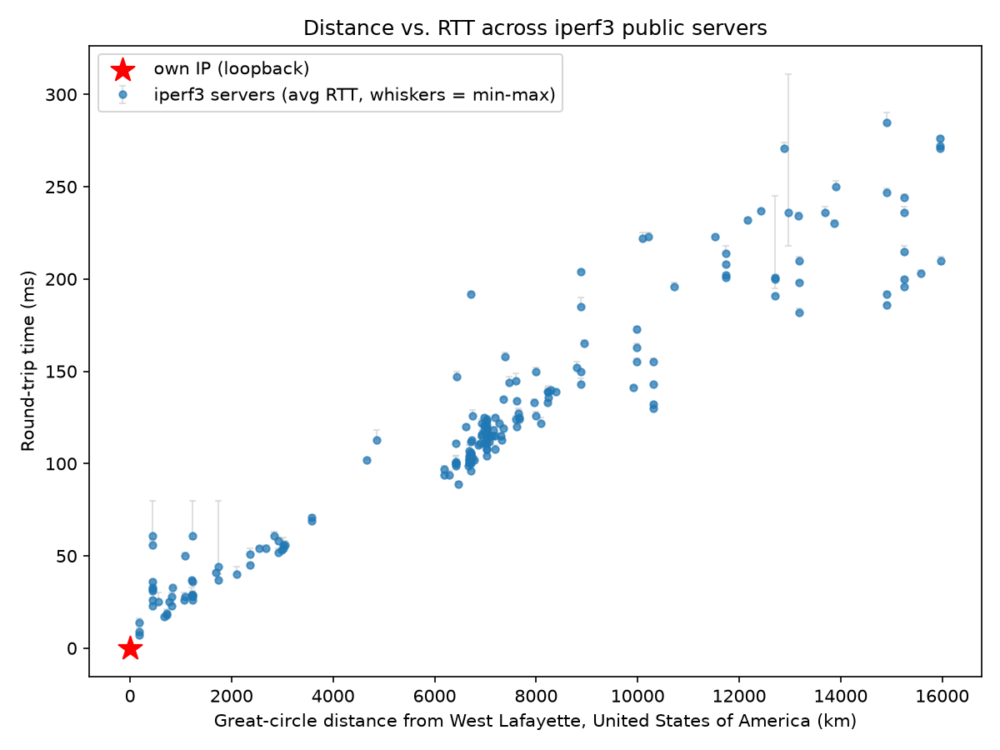
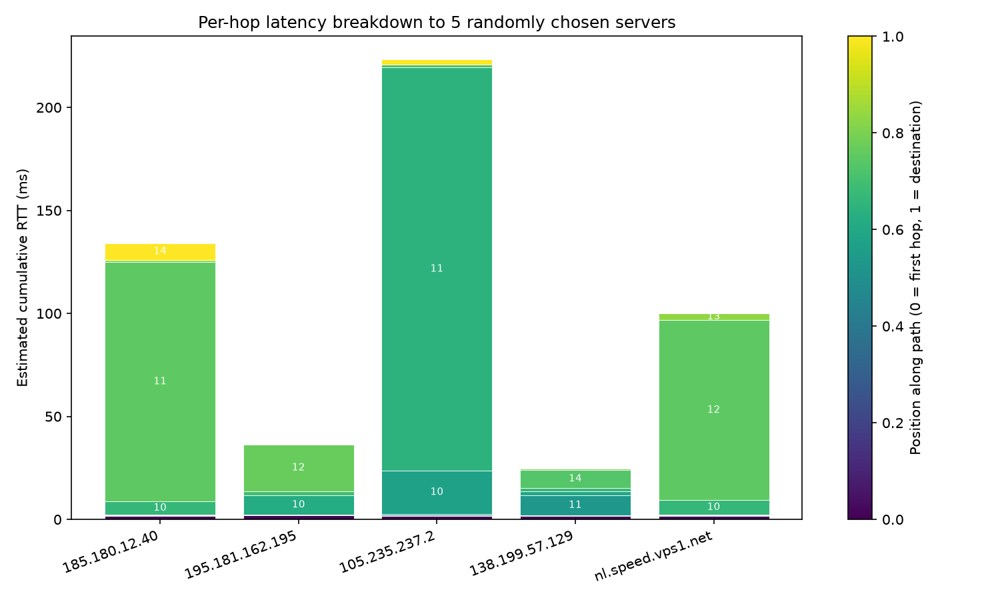
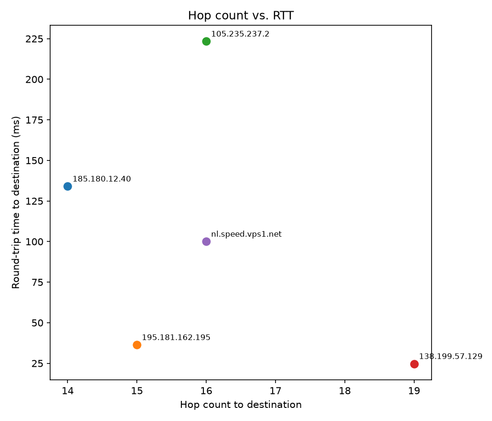

# CS 422: Assignment 1 — Network Latencies, Ping & Traceroute

**Repository:** https://github.com/ColinHermack/CS422-Assignment1

## Group Members
| Name            | Username |
|-----------------|----------|
| Thanh Bui Minh  | tbuiminh |
| Aaron Gupta     | gupt1066 |
| Rishiraj Behki  | rbehki   |
| Pranith Ravella | pravella |
| Colin Hermack   | chermack |

## Measurement Setup

All measurements were taken from a single vantage point on the Purdue campus network
in **West Lafayette, Indiana, USA** (public IP `128.211.248.45`, geolocated to
40.4259 N, −86.9081 W). The destination list is [`servers.csv`](servers.csv), containing all
**190** entries from https://iperf3serverlist.net/, with the columns
`IP/HOST, PORT, GB/S, CONTINENT, COUNTRY, SITE, PROVIDER`.

Everything runs from one command:

```bash
python run_all.py --servers servers.csv
```

[`run_all.py`](run_all.py) collects both experiments and regenerates all three plots as
both PDF and PNG in a single pass. It composes the two experiments' own option sets into
one parser ([`build_parser()`](https://github.com/ColinHermack/CS422-Assignment1/blob/main/run_all.py#L17-L26),
`run_all.py:17–26`), so every flag works identically whether a part is run through the
driver or on its own.

| Module | Role | Outputs |
|---|---|---|
| [`run_all.py`](run_all.py) | One-shot driver for both parts | all of the below |
| [`part1_ping_rtt.py`](part1_ping_rtt.py) | Part 1: ping, distance vs RTT | `part1_results.csv`, `plots/part1_distance_vs_rtt.{pdf,png}` |
| [`part2_traceroute.py`](part2_traceroute.py) | Part 2: traceroute, hop breakdown | `part2_results.csv`, `plots/part2_hop_breakdown.{pdf,png}`, `plots/part2_hopcount_vs_rtt.{pdf,png}` |
| [`geolocation.py`](geolocation.py) | Shared IP→coordinates lookup | `geo_cache.json` |

The input file is a command-line argument, not a hard-coded path.
[`load_hosts()`](https://github.com/ColinHermack/CS422-Assignment1/blob/main/part1_ping_rtt.py#L58-L78)
(`part1_ping_rtt.py:58–78`) accepts either the iperf3 CSV — any file with an `IP/HOST`
column — or a plain list of one address per line, skipping blanks and `#` comments and
de-duplicating. Both parts share it, so the two experiments cannot drift apart on what
"the input list" means.

### Geolocation

[`geolocation.py`](geolocation.py) supports two sources of publicly available data behind
one interface, [`Geolocator`](https://github.com/ColinHermack/CS422-Assignment1/blob/main/geolocation.py#L80-L195)
(`geolocation.py:80–195`):

- **IP2LOCATION-LITE-DB5**, a local ~100 MB CSV mapping IP ranges to coordinates.
  [`_lookup_db()`](https://github.com/ColinHermack/CS422-Assignment1/blob/main/geolocation.py#L124-L131)
  converts the address to a 32-bit integer and binary-searches the range table
  (`np.searchsorted`), verifying `ip_from <= n <= ip_to` so an address falling in a gap
  returns `None` rather than a neighbouring row's coordinates. **The measurements in this
  report were taken against this database.**
- **ip-api.com**, a keyless public API used when no local database is given.
  [`_lookup_api()`](https://github.com/ColinHermack/CS422-Assignment1/blob/main/geolocation.py#L135-L157)
  batches 100 addresses per request, so the whole server list costs two requests.

Either way results land in [`geo_cache.json`](geo_cache.json), which is committed and
covers all 188 resolvable addresses, so **a clean clone reproduces the run with no
database and no network lookups**. IP2LOCATION itself cannot be committed (~100 MB, and
its download now sits behind a registration token), which is why the cache exists.
`--offline` forbids API lookups and fails on a cache miss instead. See
[README.md](README.md) for setup.

---

## Part 1: Ping Test and Round-Trip Time (RTT)

### 1(a)(i) — Ping test: min, max, average RTT

Each host is pinged **10 times** (`--count`, default 10). The
[`ping()`](https://github.com/ColinHermack/CS422-Assignment1/blob/main/part1_ping_rtt.py#L81-L103)
function (`part1_ping_rtt.py:81–103`) shells out to the platform's own `ping` binary and
parses the summary line, returning `(min, avg, max)` in milliseconds.

Corner cases handled:
- **Platform differences** — separate command construction and summary regex for
  Windows (`ping -n`, `Minimum/Maximum/Average`) and Unix (`ping -c`, the
  `min/avg/max/stddev` line).
- **Non-responsive servers** — `subprocess.TimeoutExpired` and `OSError` are both caught
  (`part1_ping_rtt.py:96`), and a host that replies to nothing produces no regex match and
  also returns `None`. Either way
  [`measure()`](https://github.com/ColinHermack/CS422-Assignment1/blob/main/part1_ping_rtt.py#L106-L136)
  logs the host and drops it from the dataset rather than crashing.
- **Unresolvable hostnames** — `socket.gaierror` is caught in
  [`resolve()`](https://github.com/ColinHermack/CS422-Assignment1/blob/main/geolocation.py#L56-L61).
- **Nothing usable at all** — `run()` raises rather than writing an empty CSV and an
  empty plot (`part1_ping_rtt.py:199–200`).

**6 of 190 hosts were dropped** as non-responsive or unresolvable:
`gw1.malabo.guineanet.net`, `lg.ams-nl.gigahost.no`, `spd-desrv.hostkey.com`,
`spd-fisrv.hostkey.com`, `spd-uswb.hostkey.com`, `speed.couch.ca`. The remaining
**184 servers** (plus our own IP) are in [`part1_results.csv`](part1_results.csv).

Hosts are probed concurrently through a `ThreadPoolExecutor` (`part1_ping_rtt.py:192`,
`--workers`, default 20), which keeps the full sweep to roughly a minute instead of
serially waiting out every timeout.

### 1(a)(ii) — Geolocation coordinates

[`public_ip()`](https://github.com/ColinHermack/CS422-Assignment1/blob/main/geolocation.py#L64-L77)
determines our own public IP by querying external echo services (`api.ipify.org`, with
fallbacks), since a machine behind NAT cannot observe its own public address locally. It
is then geolocated through the same path as every destination —
[`locate_many()`](https://github.com/ColinHermack/CS422-Assignment1/blob/main/geolocation.py#L161-L191)
resolves all hostnames concurrently, then fills gaps from cache, database, and API in that
order.

Great-circle distance between our coordinates and each destination's is computed by
[`haversine()`](https://github.com/ColinHermack/CS422-Assignment1/blob/main/geolocation.py#L43-L47)
on a 6371 km sphere.

### 1(b) — Scatter plot: distance vs RTT

Generated by
[`plot_distance_vs_rtt()`](https://github.com/ColinHermack/CS422-Assignment1/blob/main/part1_ping_rtt.py#L139-L169)
(`part1_ping_rtt.py:139–169`). Each point is one destination: x = great-circle distance,
y = average RTT, with grey whiskers spanning min→max RTT for that host.



*PDF version: [`plots/part1_distance_vs_rtt.pdf`](plots/part1_distance_vs_rtt.pdf)*

The red star at the origin is our own IP. A host behind NAT normally cannot ping its own
public address (hairpin traffic is dropped at the firewall), so the script falls back to
pinging `127.0.0.1` — see the comment at `part1_ping_rtt.py:117–121`. This gives the
honest 0 km / ~0 ms "self" reference point but should be read as a loopback measurement,
not a network path.

### 1(c) — How distance relates to RTT

**Distance is by far the dominant predictor of RTT.** Across the 184 responsive servers
the Pearson correlation between great-circle distance and average RTT is **r = 0.956**.
Averaged by band, servers within 1,000 km (n = 19) return in **27.2 ms** while servers
beyond 12,000 km (n = 28) return in **226.5 ms** — an 8× increase for a ~15× increase in
distance.

The relationship is close to linear because RTT is dominated by *propagation delay*, which
is strictly proportional to path length. A least-squares fit of **minimum** RTT against
distance gives:

```
min RTT ≈ 14.8 ms per 1000 km + 15.7 ms
```

Both terms are physically meaningful:

- **The slope (14.8 ms per 1000 km)** is the cost of distance. The hard floor is the speed
  of light: a round trip of 1,000 km each way in vacuum takes 6.67 ms, and in fibre
  (where light travels at roughly ⅔ c) about **10.0 ms**. Our measured 14.8 ms is about
  **1.5× that fibre floor** — the gap is *path inflation*: fibre does not run along the
  great circle. It follows existing conduit, submarine cable landings, and inter-provider
  peering points, so the physical route is meaningfully longer than the straight-line
  distance we plot on the x-axis. Every router along the way also adds a small store-and-
  forward and lookup cost.
- **The intercept (15.7 ms)** is the distance-independent cost — the "tax" paid even for a
  zero-kilometre destination. It comes from the access network: the campus wireless/wired
  link, NAT, the campus core, and the first-mile hop out to our ISP. Part 2 confirms this
  directly: every traceroute spends its first eight hops inside private address space at a
  flat ~2 ms, and the first long-haul hop then adds 7–21 ms before any real distance is
  covered.

**Vertical spread at a fixed distance** shows what distance *cannot* explain. Three
servers sit at exactly 171.9 km (all geolocated to Chicago) yet return in 7, 9, and 14 ms.
Same physical distance, different RTT — the difference is routing (which peering point the
traffic exits through, and how directly), plus each server's own ICMP handling.
Geolocation error contributes too, and is quantified at the end of this section.

#### What min and max RTT tell us

**Minimum RTT is the measurement of distance.** It is the best-case sample out of ten: the
probe that queued behind nothing and hit no retransmission. It therefore approximates the
*irreducible* cost of the path — propagation plus serialization plus fixed per-hop
forwarding. This is why the fit above uses min rather than average, and why min correlates
with distance as tightly as it does (r = 0.956). If you want to estimate geography from
latency, min RTT is the statistic to use.

**Maximum RTT — and specifically the min→max spread — measures the state of the network,
not its geometry.** Everything above the minimum is variable delay: queueing at congested
routers, buffering on a loaded last-mile link, transient rerouting, and ICMP responses
being deprioritized on a busy router's control plane. The spread is therefore a jitter
measurement.

In our data the network was mostly quiet: the **median min–max spread is 2.0 ms** and
**82% of servers had a spread of 3 ms or less** — for those paths, all ten probes took
essentially the same route with essentially empty queues, and the path is
propagation-limited. The interesting cases are the exceptions:

| Host | Distance | min / avg / max (ms) | Spread |
|---|---|---|---|
| `speedtest.lagoon.nc` (New Caledonia) | 12,963 km | 218 / 236 / 311 | **93 ms** |
| `23.249.58.14` | 12,709 km | 195 / 200 / 245 | **50 ms** |
| `23.249.54.234` | 1,744 km | 40 / 44 / 80 | **40 ms** |

`speedtest.lagoon.nc` has a min of 218 ms that is entirely consistent with its 12,963 km
distance — the path itself is fine. But its max of 311 ms means one probe waited an extra
93 ms somewhere. That is a congested queue or a momentary reroute, and it is invisible in
the minimum. Note also that `23.249.54.234` at only 1,744 km has a 40 ms spread — larger
than most intercontinental paths. **Distance and congestion are independent axes:** a
short path can be badly congested and a very long path can be clean.

Practically: min RTT ≈ *how far away is it*, and (max − min) ≈ *how loaded is the path
right now*. Average sits between them and blends the two, which is exactly why it is the
weaker statistic for inferring distance.

#### How much to trust the x-axis

The distance axis is only as good as the IP geolocation behind it, and that error is not
negligible. Comparing the IP2LOCATION coordinates these measurements used against the
ip-api coordinates in `geo_cache.json`, for the **88 destinations that are literal IPs**
(so no re-resolution is involved):

| Statistic | Disagreement between the two sources |
|---|---|
| Median | **2.0 km** |
| Mean | **191.7 km** |
| 90th percentile | **596.8 km** |
| Maximum | **3,324.4 km** |
| Share disagreeing by >100 km | **21.6%** |

The median is excellent and the mean is terrible, which is the signature of a
**heavy-tailed** error: about four fifths of addresses are pinned to within a couple of
kilometres, and the rest can be wrong by a continent. The worst case, `156.146.53.53`,
differs by 3,324 km between sources. The usual causes are hosting providers announcing a
prefix far from where it is physically served, VPN/anycast endpoints, and registry data
that records the *registrant's* address rather than the equipment's.

This is the honest explanation for much of the vertical scatter in 1(b): some points are
plotted at the wrong x. It does not threaten the main conclusion — r = 0.956 across 184
points is far too strong to be produced by noise — but it does mean individual outliers
should be read as "possibly mislocated" before they are read as "unusually slow."

> **Note on precision:** these runs were collected on Windows, whose `ping` reports RTT
> rounded to whole milliseconds — as documented in the
> [`ping()`](https://github.com/ColinHermack/CS422-Assignment1/blob/main/part1_ping_rtt.py#L81-L103)
> docstring. Sub-millisecond structure on nearby hosts is therefore lost, visible as the
> horizontal banding at small distances. The Unix branch parses fractional milliseconds
> when the script is run on macOS or Linux.

---

## Part 2: Latency Breakdown

### 2(a) — Traceroute to 5 random destinations

[`pick_destinations()`](https://github.com/ColinHermack/CS422-Assignment1/blob/main/part2_traceroute.py#L121-L142)
(`part2_traceroute.py:121–142`) shuffles the full server list, traceroutes a batch
concurrently, and **resamples from the remainder whenever a pick fails to complete** —
so a run always ends with five usable paths rather than five attempts. `--seed` fixes the
shuffle so a specific selection can be reproduced.

[`traceroute()`](https://github.com/ColinHermack/CS422-Assignment1/blob/main/part2_traceroute.py#L91-L118)
(`part2_traceroute.py:91–118`) invokes `traceroute -n` / `tracert -d` with a 20-hop budget
(`--max-hops`) and a 1 s per-probe timeout (`--trace-timeout-ms`), and implements the two
failure modes the assignment distinguishes:

- **Individual `*` hops** — a router that does not answer ICMP TTL-exceeded. These are
  *filtered out*, keeping only hops with both an address and at least one timed probe
  (`part2_traceroute.py:115–117`); the remaining probes for that hop are averaged. The
  traceroute is still considered successful.
- **Non-responsive destination** — if nothing parsed, or if the trace ran through the
  entire 20-hop budget without the destination ever replying, the path is marked
  non-responsive and returns `None` (`part2_traceroute.py:110–113`), and the caller
  resamples.

This distinction matters in practice: **hop 9 failed to respond on all five paths** and was
silently filtered, while all five destinations answered at their final hop, so all five
traces are valid. Per-hop measurements are in [`part2_results.csv`](part2_results.csv).

The five destinations selected on this run:

| Destination | Advertised site | Distance | Hops | RTT to destination |
|---|---|---:|---:|---:|
| `138.199.57.129` | Toronto, CA | 550 km | 19 | 24.7 ms |
| `195.181.162.195` | Miami, US | 441 km | 15 | 36.3 ms |
| `nl.speed.vps1.net` | Dronten, NL | 6,720 km | 16 | 100.0 ms |
| `185.180.12.40` | Vienna, AT | 7,614 km | 14 | 134.0 ms |
| `105.235.237.2` | Equatorial Guinea | 10,217 km | 16 | 223.3 ms |

"Advertised site" is the `SITE` column of `servers.csv`; the distance is computed from the
IP2LOCATION coordinates actually used in the plots. **The two disagree for the first two
rows**, which is the geolocation tail described in 1(c) showing up directly in our sample:
IP2LOCATION places `195.181.162.195` in Kentucky (441 km) while both `servers.csv` and
ip-api say Miami (1,744 km), and it places `138.199.57.129` in London, Ontario (550 km)
against Toronto (718 km). The Vienna, Dronten and Equatorial Guinea rows agree across all
sources. None of the conclusions below depend on the distance column — they rest on hop
counts and measured RTTs — but the disagreement is worth stating rather than papering over.

### 2(b) — Stacked bar chart: per-hop latency breakdown

Generated by
[`plot_hop_breakdown()`](https://github.com/ColinHermack/CS422-Assignment1/blob/main/part2_traceroute.py#L145-L179)
(`part2_traceroute.py:145–179`). Each bar is one destination; each segment is one hop's
*incremental* contribution (that hop's RTT minus the previous hop's), so total bar height
is the RTT to the destination. Colour encodes position along the path (dark = first hop,
yellow = destination) and segments larger than 3 ms are labelled with their hop number.



*PDF version: [`plots/part2_hop_breakdown.pdf`](plots/part2_hop_breakdown.pdf)*

### 2(c) — Scatter plot: hop count vs RTT

Generated by
[`plot_hopcount_vs_rtt()`](https://github.com/ColinHermack/CS422-Assignment1/blob/main/part2_traceroute.py#L182-L198)
(`part2_traceroute.py:182–198`). One point per destination: x = hop count at which the
destination replied, y = RTT to that final hop.



*PDF version: [`plots/part2_hopcount_vs_rtt.pdf`](plots/part2_hopcount_vs_rtt.pdf)*

### 2(d) — Observations

#### Hop count does not predict RTT

The scatter in 2(c) shows **no usable relationship**. The two extremes make the point on
their own:

- `138.199.57.129` (Toronto) — **the most hops of the five (19), and the lowest RTT (24.7 ms)**
- `105.235.237.2` (Equatorial Guinea) — **fewer hops (16), and 9× the RTT (223.3 ms)**

The correlation across these five destinations is r = −0.38. **That number should not be
read as evidence of a negative relationship**, because with n = 5 the coefficient is
dominated by which servers happen to be sampled. We checked this directly: re-running
Part 2 from a different network drew five different destinations and produced **r = +0.61**
— the opposite sign, from the same code and the same server list. Five points cannot
distinguish a weak trend from noise, so the honest conclusion is the *absence* of a
reliable relationship, not the presence of an inverse one.

What is robust is the mechanism behind it. Adding a router to a path costs microseconds of
lookup and store-and-forward. Adding 10,000 km of fibre costs ~100 ms of propagation.
**Hop count and RTT measure different things**: hop count is a property of the routing
topology, RTT is dominated by physical distance. Part 1 makes the contrast concrete — over
184 destinations, distance predicts RTT with r = 0.956, a sample large enough for the
coefficient to mean something.

#### Latency is not spread across hops — one hop dominates

The stacked bars in 2(b) are the clearest result. Every path has the same shape: a flat
base, then **one enormous segment**, then a thin cap.

| Destination | Dominant hop | Jump | Share of total RTT |
|---|---|---:|---:|
| `105.235.237.2` (Eq. Guinea) | 11 → `185.35.141.155` | +195.7 ms | **88%** |
| `185.180.12.40` (Vienna) | 11 → `171.75.8.159` | +116.3 ms | **87%** |
| `nl.speed.vps1.net` (NL) | 12 → `4.30.181.50` | +87.3 ms | **87%** |
| `195.181.162.195` | 12 → `68.86.85.58` | +29.0 ms | **80%** |
| `138.199.57.129` (Toronto) | 11 → `213.248.91.100` | +9.7 ms | **39%** |

This is the one Part 2 finding that reproduces cleanly across runs: a re-run from a
different network, with five different destinations and a completely different access
path, again put **50–89% of total RTT in a single hop** (median 85%).

That single hop is the **long-haul link** — the transoceanic or long-distance backbone
span. It is one "hop" in the traceroute's accounting but hundreds or thousands of
kilometres of fibre, and it carries almost all of the propagation delay. This is why the
bars in 2(b) for Equatorial Guinea and Vienna are visually one giant block: hop counts of
16 and 14 are misleading, because 13 of those hops are nearly free.

#### The access network is a fixed cost, identical on every path

**Hops 1–8 are identical across all five destinations** and always cost about **2 ms**:

```
1  100.69.192.2     (CGNAT)      ~2.0 ms
2  192.168.2.222    (private)    ~2.0 ms
3  192.168.18.2xx   (private)    ~2.0-3.3 ms
4  172.28.249.1xx   (private)    ~2.7-3.3 ms
5  172.28.253.228   (private)    ~2.0 ms
6  172.28.253.242   (private)    ~2.3 ms
7  172.28.249.222   (private)    ~2.0 ms
8  72.12.199.192    (first public) ~2.0-2.7 ms
```

Seven private-address hops inside the campus network, then the border router. **Regardless
of whether the destination is 441 km or 10,217 km away, the first eight hops cost the same
~2 ms** — under 2% of the total for the long paths, but 8% for Toronto. This is the direct
measurement of the 15.7 ms intercept estimated in Part 1(c): the distance-independent
component of RTT is real, is incurred before any long-haul link is touched, and is
structurally the same for every destination. (Our campus's internal contribution here is
lower than the fitted intercept, which also absorbs the first ISP hop and each server's own
response overhead.)

#### Cumulative RTT is not monotonic

Several traces show RTT *decreasing* at a later hop — `nl.speed.vps1.net` reads 128.0 ms at
hop 14 but 100.0 ms at the destination (hop 16), and `195.181.162.195` reads 42.7 ms at hop
12 but 36.3 ms at hop 13. This is expected and does not indicate a measurement error:

1. Intermediate hop RTTs come from **ICMP TTL-exceeded messages generated by the router's
   control plane**, which is slower and lower-priority than the forwarding hardware that
   serves the destination's actual reply. A busy transit router can take longer to
   *announce* itself than the endpoint beyond it takes to answer.
2. **Return paths may be asymmetric.** Each hop's RTT includes a return journey that need
   not follow the forward path, so hop *n*'s round trip is not necessarily a subset of hop
   *n+1*'s.
3. Each hop is only three probes, so noise is not averaged away.

The stacked bar chart clamps negative increments to zero (`part2_traceroute.py:159`) so
that segments remain non-negative and the bar height equals the destination RTT.

#### Summary

Latency on the public Internet is **geographic, not topological**. Hop count tells you how
many devices are involved; it tells you almost nothing about how long the trip takes. RTT
is set by the length of the physical path, concentrated in a small number of long-haul
links, plus a fixed access-network cost at the edge — and any excess above that floor
(the min→max spread from Part 1) is congestion, which varies independently of both.

---

## Reproducing These Results

Setup is in [README.md](README.md). Both experiments and all three plots, in one command:

```bash
python run_all.py --servers servers.csv
```

This writes `part1_results.csv`, `part2_results.csv`, and PDF + PNG versions of every plot
into `plots/`. Useful options: `--count` (pings per destination), `--num-destinations`
(traceroute targets), `--max-hops`, `--seed` (fix the random traceroute sample), and
`--skip-part1` / `--skip-part2`.

### Verification run

The pipeline was re-run end to end from a **different network and a different operating
system** (macOS rather than Windows, a residential connection rather than the campus one,
and ip-api coordinates rather than IP2LOCATION) to check that the Part 1 conclusions are
properties of the Internet and not of one measurement session:

| Statistic | This report | Verification run |
|---|---:|---:|
| Pearson r, distance vs avg RTT | 0.956 | 0.944 |
| min-RTT slope | 14.8 ms / 1000 km | 15.5 ms / 1000 km |
| min-RTT intercept | 15.7 ms | 11.5 ms |
| Mean RTT, <1000 km | 27.2 ms | 25.0 ms |
| Mean RTT, >12,000 km | 226.5 ms | 232.7 ms |
| Median min–max spread | 2.0 ms | 1.5 ms |
| Share with spread ≤3 ms | 82.1% | 82.3% |

Every Part 1 result holds. The lower intercept is the expected direction and is itself
evidence for the interpretation in 1(c): that term is the access network, and the
verification run's path to its border router is shorter than the campus one — 1 private
hop instead of 7.

For Part 2, the "one hop dominates" structure reproduced (50–89% of RTT in a single hop),
while the hop-count correlation did not and flipped sign, for the reasons given in 2(d).

### Caveats on re-running

- Part 2 samples destinations at random, so a re-run selects a different five unless
  `--seed` is passed. The qualitative conclusions hold regardless.
- A clean clone geolocates from the committed `geo_cache.json`, which was populated from
  ip-api rather than IP2LOCATION. Per the table in 1(c), the two agree to a median of
  2.0 km but disagree by more than 100 km on about a fifth of addresses, so a re-run's
  distance axis will differ slightly from the plot in this report. Pass
  `--geo-db IP2LOCATION-LITE-DB5.CSV` to reproduce the original x-values exactly.
